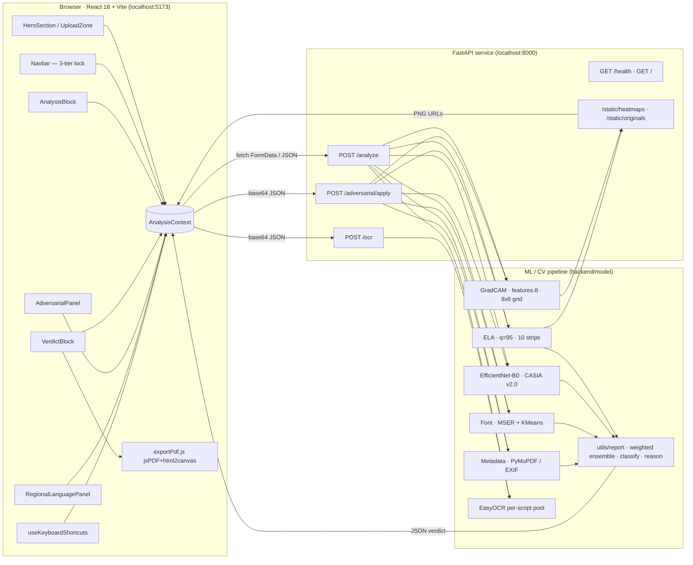

# FORENSIQ — Technical Documentation

> Explainable multi-signal document forgery detection, built for
> environments where the cost of a false negative is a forged
> credential in circulation.

---

## 1. Project Overview

FORENSIQ is an **Explainable AI document forgery detection system**
that ensembles four independent forensic signals into a single verdict,
then surfaces the *reasoning* behind that verdict through visual
heatmaps, forgery-localized bounding boxes, per-strip confidence
timelines, plain-English explanations, and an exportable PDF report.

The value proposition in three sentences:

1. Most commercial forgery detectors return a black-box score; FORENSIQ
   returns a score **plus** the pixel regions, the text regions, the
   metadata fields, and the per-strip confidence bands that produced
   it — explainability is a first-class output, not an afterthought.
2. FORENSIQ treats Indic-language documents as first-class citizens —
   Tamil, Hindi, Telugu, Kannada, Malayalam, and English are checked
   at the **glyph level**, not pixel level, using EasyOCR per-script
   readers plus a per-character kerning-variance analyzer.
3. FORENSIQ ships with an **adversarial stress-test mode** — the same
   endpoint that analyzes a document also lets a verifier attack it
   (brightness shift, JPEG recompression, copy-move patch) and
   re-analyze it, so the detector's robustness is demonstrated, not
   claimed.

### What makes FORENSIQ different

- **Multi-signal ensemble.** Four independent forensic methods cross-
  validate each other (ELA, EfficientNet-B0 CNN, MSER+KMeans font
  analysis, and PDF/EXIF metadata forensics) — a single signal cannot
  push the verdict past threshold alone.
- **XAI-native output.** GradCAM heatmap, top-3 bounding boxes labelled
  *Region A/B/C*, per-signal score+confidence breakdown, and a
  plain-English reason sentence ship with every verdict.
- **Regional language support.** Script-specific EasyOCR readers are
  spun up on demand for six scripts; each glyph is measured against
  its line's median aspect ratio and flagged when it drifts.
- **Adversarial robustness mode.** The `/adversarial/apply` endpoint
  mutates a document and re-runs the full pipeline so operators can
  see the confidence delta before and after an attack.
- **Bounding-box localization.** The final EfficientNet feature map
  (`features.8`) is sliced into an 8×8 activation grid; the top-3
  cells are promoted to pixel-space boxes so forgery is *located*, not
  just *flagged*.

### Feature inventory (verified in the codebase)

| Feature | Where it lives |
|---|---|
| Single-file upload | `frontend/src/components/UploadZone.jsx` · `batchMode = false` |
| Batch upload (2–10 files, sequential) | `UploadZone.jsx` + `runBatch` in `AnalysisContext.jsx` |
| Four-signal detection engine | `backend/model/{ela,inference,font_analysis,metadata_check}.py` |
| GradCAM heatmap | `backend/model/gradcam.py`, hooked on `features.8` |
| Comparative before/after slider | `frontend/src/components/ComparativeSlider.jsx` (16/10 locked aspect ratio) |
| Forgery bounding boxes (Region A / B / C) | `_top_boxes_from_cam(..., top_k=3, grid=8)` in `gradcam.py` |
| 10-strip confidence timeline | `build_timeline(..., num_strips=10)` in `utils/report.py` · `ConfidenceTimeline.jsx` |
| Adversarial stress test (brightness · JPEG · copy-move) | `backend/main.py::_apply_attack` · `AdversarialPanel.jsx` |
| Regional OCR — Tamil/Hindi/Telugu/Kannada/Malayalam/English | `backend/model/ocr_pipeline.py` (`SCRIPT_TO_LANG`) |
| Glyph-level anomaly detection | `DEVIATION_THRESHOLD = 0.30` in `ocr_pipeline.py` |
| Font spacing / kerning heatmap (8×16) | `_pad_heatmap(rows=8, cols=16)` · `RegionalLanguagePanel.jsx` |
| Batch results comparative table | `BatchResultsTable.jsx` (with >1800 px extra columns) |
| Per-document verdict switcher | `BatchDocumentSelector.jsx` (horizontal chip row) |
| Session confidence history chart | `ConfidenceHistory.jsx` (Recharts LineChart) |
| One-click PDF export | `frontend/src/utils/exportPdf.js` (jsPDF + html2canvas) |
| Sequential nav locking (3 tiers) | `Navbar.jsx` · `hasSeenAnalysis` / `hasSeenVerdict` flags |
| Keyboard shortcut layer | `frontend/src/hooks/useKeyboardShortcuts.js` + `KeyboardShortcutsModal.jsx` |
| Multi-page PDF, per-page heatmaps | `_prepare_image` in `main.py` + `result.pages[]` payload |
| Progressive pipeline log (10 steps) | `PIPELINE_STEPS` in `AnalysisContext.jsx` · `ProcessingLog.jsx` |
| Untrained-CNN graceful fallback | `inference.py::predict` returns score 0.5 · `select_weights` reweights |

---

## 2. Problem Significance

Document forgery in India has shifted from being a fringe concern to a
systemic one. Three domains bear most of the cost:

- **College admissions.** Marksheets, migration certificates, and
  provisional-degree letters from state boards are routinely doctored
  to inflate percentages or fabricate passing marks entirely.
  Verification officers at central universities cannot visit every
  issuing board; they receive a scanned PDF and a deadline.
- **Scholarship and government benefits.** Caste certificates, income
  certificates, and Aadhaar-linked affidavits are edited to qualify
  for benefits the applicant is not entitled to. A single misallocated
  scholarship is a few tens of thousands of rupees; the aggregate is
  material.
- **Identity and KYC.** Banks and telecoms rely on customer-supplied
  PDFs for KYC in the hinterland. Every one of those PDFs is a forgery
  risk.

### Why existing tools fail

- **Pixel-only detectors** (ELA-only tools, JPEG ghost analyzers)
  collapse when the forger re-saves a document at a lower quality —
  the compression ghost they depend on is erased by a single extra
  save. FORENSIQ's `/adversarial/apply jpeg_compress` endpoint
  demonstrates this exact failure mode on demand.
- **Black-box classifiers** return a probability and nothing else.
  A verification officer cannot staple "0.87" to a file and defend a
  rejection in court. The reason string and the per-region bounding
  boxes that FORENSIQ emits are the difference between a score and a
  report.
- **English-only OCR** mis-tokenizes Devanagari and Dravidian scripts.
  In `ocr_pipeline.py` we explicitly run Pass 1 with the English
  reader, detect the dominant Unicode range with `detect_script()`,
  and then spin up a **dedicated per-script EasyOCR Reader** for Pass
  2 — because EasyOCR forbids stacking most Indic scripts in a single
  Reader instance.
- **No adversarial testing.** Most academic detectors are benchmarked
  on clean test splits. Real forgers iterate.

### Why explainability matters

Verification officers are paid to make decisions they can defend, not
score them. FORENSIQ's verdict screen surfaces:

1. A short **plain-English reason** built by `generate_reason()` in
   `utils/report.py` — e.g. *"Pixel compression artifacts detected in
   strip 3/10 — 78% confidence of tampering"*.
2. A **MultiSignalReport** tile per signal, showing the raw score, the
   confidence, and the contributing findings (hot strip count, flagged
   font regions, listed metadata anomalies).
3. A **GradCAM heatmap** blended at 50/50 with the original image
   (hard-coded in `gradcam.py`: *"never CAM-only, so the viewer can
   still make out the document structure"*).
4. **Top-3 bounding boxes** — *Region A*, *Region B*, *Region C* — with
   per-region confidence, so the officer can point at "this stamp
   region, 94% suspicious".
5. A **one-click PDF** (`exportPdf.js`) that serializes the verdict,
   signal table, heatmap snapshot, bounding-box coordinates, and OCR
   extract into an archivable A4 document.

### Why regional language support matters

The vast majority of Indian government-issued documents at the state
level are bilingual at best and native-script only at worst. A Tamil
Nadu caste certificate, an Uttar Pradesh land-record extract, or a
Karnataka transfer certificate cannot be forensically analysed by a
Latin-only OCR pipeline — every character falls outside the model's
training distribution, so every character looks "anomalous". FORENSIQ
handles this by detecting the dominant script first (`detect_script()`
scans Unicode code points against `SCRIPT_RANGES`) and swapping in a
script-specific Reader before running the glyph-metric analyzer.

---

## 3. System Architecture

### Diagram



### Request walkthrough — single document

1. **Drop.** User drops a PDF / PNG / JPG / TIFF on `UploadZone`. The
   component validates size (≤ 50 MB, `MAX_BYTES`) and calls
   `onUploaded()` *before* awaiting the analyze promise — this flips
   `screen` to `'analysis'` so the `ProcessingLog` becomes visible
   while the network call is still in flight (FIX 2 in
   `AnalysisContext.jsx`).
2. **Upload.** `analyzeDocument(file)` in `services/api.js` posts
   `multipart/form-data` to `POST /analyze`.
3. **Prepare.** `_prepare_image` in `backend/main.py` writes the upload
   to `backend/temp/`. If it's a PDF, PyMuPDF (`fitz`) rasterizes every
   page at 220 DPI into per-page PNGs. Each page's PNG is published to
   `backend/static/originals/` as `orig_<uuid>.png` and served under
   `/static/originals/`.
4. **Parallel signals — run in-process (Python is single-threaded,
   executions are sequential but independent):**
   - `compute_ela(image_path, HEATMAP_DIR)` — re-encodes at JPEG q=95,
     takes the pixel difference, amplifies ×10, slices into 10
     horizontal strips, writes the residual PNG to
     `/static/heatmaps/ela_<uuid>.png`, returns `score`, `confidence`,
     `regional_scores[10]`.
   - `cnn_predict(image_path)` — loads the EfficientNet-B0 checkpoint
     (or falls back to ImageNet pretrained weights — see §4), resizes
     to 224×224, returns `{score, confidence, backbone, trained}`.
   - `generate_gradcam(image_path, HEATMAP_DIR)` — forward-backward
     pass through the CNN with hooks on `features.8`, computes the
     GradCAM, normalizes it, blends 50/50 with the original, and
     derives the top-3 bounding boxes from the 8×8 activation grid.
   - `analyze_fonts(image_path)` — OpenCV MSER text-region detection,
     clusters geometric features with `KMeans(n_clusters=3)`, flags
     regions whose area z-score exceeds 2σ from the majority cluster.
   - `check_metadata(image_path, is_pdf)` — routes to `check_pdf` or
     `check_image`; flags timestamp inversion, known editor
     fingerprints (Photoshop/GIMP/Inkscape/Affinity/Pixlr/CorelDRAW/
     Paint.NET/Krita), empty PDF author field, and EXIF
     `DateTime` / `DateTimeOriginal` drift > 60 s.
   - `run_ocr(image_path)` — two-pass EasyOCR (English first, then a
     per-script Reader if Indic glyphs are detected), followed by a
     per-character width/height-ratio analyzer that flags glyphs whose
     metric drifts > 30% from the line's median.
5. **Ensemble.** `ensemble_score()` weighs the four signal scores
   (CNN's weight is dropped to 0 if the checkpoint is missing, see §4)
   and `classify()` maps the result to one of three verdicts:
   `GENUINE` / `SUSPICIOUS` / `FORGED`. `generate_reason()` picks the
   highest `score × confidence` signal and formats a human sentence.
6. **Timeline.** `build_timeline()` converts ELA's 10 per-strip means
   into timeline bands with per-band status (`clean` / `warning` /
   `suspicious`).
7. **Per-page loop.** For multi-page PDFs, steps 4–6 are re-run per
   page for ELA + GradCAM only; CNN / font / metadata / OCR run once
   on page 1 (they are document-level or expensive).
8. **Response.** A single JSON payload comes back with `verdict`,
   `confidence`, `reason`, `signals`, `weights_used`, `gradcam_url`,
   `original_url`, `regional_language`, `timeline`, `pages[]`,
   `bounding_boxes`, `elapsed_ms`, `sha256`, `page_info`.
9. **Render.** `AnalysisContext` stores the result; `ForensicsViewer`
   draws the heatmap + bounding box overlay (with a `ResizeObserver`
   so the SVG overlay stays aligned on container resize),
   `ConfidenceTimeline` draws the 10 strip bands, `MultiSignalReport`
   draws the four signal cards, and the `VerdictProceedAction` button
   pulses until the user elects to proceed to the Verdict screen.

### Batch mode

`runBatch(files)` in `AnalysisContext.jsx`:

- Trims to max 10 files (`BATCH_MAX`), requires min 2 (`BATCH_MIN`).
- Seeds `batchResults[]` with `{id, filename, status: 'pending',
  size, startedAt, finishedAt}` rows.
- Iterates serially, setting each row to `analyzing`, awaiting
  `analyzeDocument`, and setting the row to `done` / `error`.
- The **first successful** row is loaded into the main viewer
  immediately so the user sees a document instead of a spinner.
- The **last successful** row becomes the default selection once the
  batch finishes — "most recently analyzed" is the UX default.
- `BatchDocumentSelector` renders a chip row at the top of the
  Verdict screen once `doneRows.length >= 2`; clicking a chip calls
  `loadBatchResult(id)`, which swaps every downstream panel (viewer,
  timeline, multi-signal, regional) to that row's stored result
  **without** re-analyzing. Arrow-left / arrow-right cycle the
  selection via `shiftBatchSelection(±1)`.

### Adversarial mode

`runAdversarial(operation, intensity)` calls `POST /adversarial/apply`
with the base64 of the last-uploaded file. On the backend:

1. The file is decoded and re-prepared by `_prepare_image`.
2. `_apply_attack` runs **before** re-analysis:
   - `brightness` → `ImageEnhance.Brightness(img).enhance(1 + intensity)`, clamped to [0.1, 3.0].
   - `jpeg_compress` → re-saves at `quality = intensity × 100`, clamped to [5, 100].
   - `copymove` → lifts a 50×50 pixel patch and pastes it onto an
     offset target location (see `_copy_move`).
3. `_pipeline_from_image` re-runs the **full** 4-signal + OCR pipeline
   on the modified image.
4. The response adds `modified_image_base64`, `source_operation`,
   `source_intensity` so `AdversarialPanel` can render the before/
   after verdicts side-by-side.

### Multi-page PDFs

`_prepare_image` detects PDFs by extension, uses `fitz.open()` to load,
and calls `page.get_pixmap(dpi=220)` for each page. The first page is
used for CNN / font / metadata / OCR; every page gets its own ELA +
GradCAM + 10-strip timeline. The response returns `pages[]` with one
entry per page, plus `page_info.total_pages`. On the frontend,
`ForensicsViewer` reads `result.pages[currentPage]`; `←` / `→` key
handlers in `useKeyboardShortcuts.js` increment / decrement
`currentPage` without re-firing the pipeline.

---

## 4. Detection Engine — Deep Dive

### 4.1 Error Level Analysis (ELA) — `backend/model/ela.py`

**What it detects.** JPEG is lossy. Every save-and-reload cycle
introduces a characteristic quantization residual that is spatially
uniform for a single-generation image and spatially *non*-uniform when
a region has been pasted in from a different compression history
(different quality, different source JPEG quantization table). By
re-saving the uploaded image at a known quality (`ELA_QUALITY = 95`)
and taking the absolute per-pixel delta from the original, the
re-compression residual is exposed.

**Amplification.** Raw residuals are near-zero in uint8 space. The
module multiplies by `AMPLIFY = 10.0` and clips back to [0, 255] so
tampered regions pop visually. The residual is written to
`/static/heatmaps/ela_<uuid>.png` and surfaced in the UI.

**Per-strip scoring.** The grayscale residual is sliced into
`NUM_STRIPS = 10` horizontal bands. The per-band mean (normalised to
[0, 1]) becomes `regional_scores[]`. The overall ELA score is
`min(1.0, mean(regional) × 3.0)` — a deliberate amplification so even
a single hot strip registers in the ensemble. Confidence is derived
from the *variance* across strips (`0.55 + variance × 30.0`, capped at
1.0): a document with uniformly elevated residual reads as "noisy
scan" (low confidence); a document with one hot strip and nine clean
strips reads as "localized tampering" (high confidence).

### 4.2 EfficientNet-B0 CNN — `backend/model/inference.py` + `train.py`

**Why EfficientNet-B0.** The B0 variant hits the sweet spot for
document forensics: 5.3M parameters (small enough to run on CPU in
~2 s), 224×224 input (native for scanned document thumbnails),
compound scaling (balanced depth/width/resolution — so early layers
capture low-level compression artifacts and later layers capture
semantic layout anomalies). The alternative candidates — VGG16 is
138M params and too slow for live verification; ResNet-50 is 25M and
doesn't have the compound-scaling balance that favours dense document
imagery.

**Training dataset.** `train.py` walks `D:\FORENSIQ\data\archive\` and
picks up any folder literally named `Au/` (authentic, label 0) or
`Tp/` (tampered, label 1). The repository bundles:

- `CASIA2/Au/` — 7,491 authentic images
- `CASIA2/Tp/` — 5,123 tampered images (splices, copy-moves, removals)
- `CASIA1/{Au,Sp}/` — additional legacy split

CASIA v2.0 is the standard academic benchmark for image forgery
classification: the authentic set is curated clean photography across
nine object categories; the `Tp` set is algorithmically spliced /
copy-move-tampered with the ground-truth labels encoded in the
filename (e.g. `Tp_D_CND_M_N_ani00018_sec00096_00138.tif` — *D*ifficult
*C*opy-move, moved *N*ot-post-processed, source region
`ani00018_sec00096`). This is what the model learns to separate.

**Training recipe** (in `train.py`):

- Stratified 80 / 10 / 10 split, seed 42.
- Train transforms: `Resize(240) → RandomHorizontalFlip →
  RandomRotation(15) → ColorJitter(0.2, 0.2) → CenterCrop(224) →
  ToTensor → ImageNet-normalise`.
- Eval transforms: `Resize(224) → ToTensor → ImageNet-normalise`.
- Optimizer: `AdamW` (`lr=1e-4`, `weight_decay=1e-2`) with
  `CosineAnnealingLR(T_max=epochs)`.
- Loss: `CrossEntropyLoss`, 2-class head (`Linear(1280, 2)` replaces
  the default classifier).
- Best-val-loss checkpointing with `patience=5` early stop.
- Final evaluation prints accuracy, precision, recall, F1 on the held
  out test split.

**Checkpoint status at time of writing.**
`backend/model/checkpoints/` is **empty** in the shipped repository.
`inference.py::is_trained()` returns `False`, `predict()` returns a
neutral `score: 0.5, confidence: 0.15, trained: False` payload, and
`select_weights(cnn_trained=False)` in `utils/report.py` switches the
ensemble to the **fallback weight vector**:

```python
UNTRAINED_WEIGHTS = {"ela": 0.55, "cnn": 0.00, "font": 0.25, "metadata": 0.20}
```

This is by design — the system runs end-to-end without a trained CNN,
but the CNN signal is zeroed out so it cannot pollute the ensemble
with neutral noise. Running `python backend/model/train.py` materializes
`efficientnet_forensiq.pth` and the API automatically picks it up on
next start (`load_model()` is lazy).

### 4.3 GradCAM — `backend/model/gradcam.py`

**How it localizes.** The GradCAM implementation hooks the last
convolutional block of EfficientNet-B0 — `model.features[-1]`, which
is `features.8` — with a forward hook (captures the 7×7 feature map)
and a full-backward hook (captures the gradient of the forged-class
logit w.r.t. that feature map). The standard weighting
`α_k = mean(∂y/∂A_k)` is computed, and the weighted sum
`ReLU(Σ_k α_k · A_k)` is bilinearly upsampled to the original image
resolution, min-max-normalized, and colour-mapped with OpenCV's
`COLORMAP_JET`.

**Integrity check.** The module verifies the activation dynamic range
is at least 10% of full scale; if the hooks fired but the CAM is flat,
a clear `WARNING: GradCAM hooks may not be attached correctly…` log
line is emitted so the problem surfaces in stdout rather than silently
producing a blank heatmap.

**Blend.** The final heatmap is 50% original + 50% CAM (hard-coded,
commented: *"never CAM-only, so the viewer can still make out the
document structure underneath the heatmap"*). The result is saved as
`/static/heatmaps/gc_<uuid>.png`.

**Bounding-box derivation (`_top_boxes_from_cam`).** The normalized CAM
is sliced into an **8×8 grid** of cells. Each cell's mean activation
is computed. The cells are ranked descending, and the **top 3** are
promoted back to pixel-space boxes `{label, confidence, x, y, width,
height}` with the labels *Region A*, *Region B*, *Region C* (labels
up to *E* exist in the `labels` array; only 3 are returned).
Confidence per box is the cell's mean activation clipped to [0, 1]. This
means *Region A* is always the most-activated cell, not the
spatially-first one — intensity ranking, not reading order.

### 4.4 Font Consistency — `backend/model/font_analysis.py`

**Why MSER.** Maximally Stable Extremal Regions is a classical blob
detector that lights up on glyph-sized high-contrast connected
components — i.e. individual characters. The detector is configured
with `setMinArea(40)` and `setMaxArea(0.05 × H × W)` so noise specks
and full-page blocks are ignored.

**What KMeans clusters on.** Each detected region contributes a
3-dimensional feature vector `[area, aspect_ratio, mean_intensity]`.
`KMeans(n_clusters=3)` groups the population into three font "modes"
(typically: body text, headings, decorative / signature marks). The
**majority cluster** (largest `bincount`) is treated as the document's
baseline font population.

**Outlier test.** For each region, `z = |area - mean_majority| /
std_majority`. Any region with `z > 2.0` is flagged — these are
"characters whose size doesn't match the document's dominant font".
This is exactly the signal that copy-paste forgery produces: a single
number pasted from a different line height, a stamp text rendered at
a different point size, a stitched-in signature from a higher-DPI
scan. Up to 32 flagged regions are returned (`flagged[:32]`), sorted
by descending z-score.

**Kerning variance.** The inter-character spacing analyzer lives in
the OCR pipeline (§4.6) since it needs line-level bounding boxes;
MSER alone doesn't know which regions belong to the same line.

### 4.5 Metadata Forensics — `backend/model/metadata_check.py`

**PDFs.** PyMuPDF reads `doc.metadata` and flags:

- **Timestamp inversion** — `modDate < creationDate` means the document
  was modified before it was created, which is impossible unless the
  metadata was hand-edited.
- **Editor fingerprints** — any of `photoshop`, `gimp`, `inkscape`,
  `affinity`, `pixlr`, `coreldraw`, `paint.net`, `krita` found in the
  `producer` or `creator` string. Legitimate PDFs of official documents
  are produced by Word, Acrobat, or institutional scanners — not raster
  editors.
- **Empty author field** on a PDF that claims to be an official record.

**Images (EXIF).** Pillow's `_getexif()` is decoded against
`ExifTags.TAGS` and flagged for:

- Raster-editor `Software` tag.
- Any `Software` tag at all (legitimate scans from consumer scanners
  still get a surfaced tag, which is informational rather than
  incriminating).
- Partial `GPSInfo` blocks.
- `DateTime` vs `DateTimeOriginal` drift > `TIMESTAMP_DRIFT_SECONDS`
  (= 60 s) — a small drift is normal (the camera's write time differs
  from shutter time); anything larger suggests an editor rewrote only
  one of the two fields.

**Scoring.** `score = min(1.0, n_anomalies × 0.3)` — three flags max
out the metadata signal at score 0.9; confidence scales with flag
count.

### 4.6 OCR + glyph forensics — `backend/model/ocr_pipeline.py`

**Two-pass strategy.** EasyOCR does not let you stack most Indic
scripts in a single `Reader` instance (the recognizer models are
incompatible). The pipeline therefore:

1. Runs Pass 1 with the English-only reader (always available — no
   cold-start risk).
2. Concatenates the recognized text and runs `detect_script()`, which
   counts each character's Unicode code point against `SCRIPT_RANGES`
   and returns the dominant script if it accounts for >20% of printable
   glyphs.
3. If Pass 1 says the document is Hindi / Tamil / Telugu / Kannada /
   Malayalam, the pipeline lazily constructs the dedicated Reader
   (e.g. `easyocr.Reader(['ta', 'en'], gpu=False)` for Tamil) and
   re-runs.

**Per-glyph metric analysis.** For each recognized line, every
character's width/height ratio is computed (average per-character box
width / line height). The line's median ratio is the baseline; any
glyph whose |ratio − median| / median exceeds `DEVIATION_THRESHOLD =
0.30` (30%) is flagged with `reason = "metric drift XX%"`. The
rationale: a legitimate document's line of text is typeset by a single
font renderer, so intra-line aspect variance is near-zero. A forged
line — where someone has pasted a different name or date from a
different source — carries heterogeneous glyph metrics.

**Kerning heatmap.** Every flagged glyph's deviation is accumulated
into a row vector; rows are interpolated into an 8×16 grid by
`_pad_heatmap(rows=8, cols=16)` and shipped to the frontend as
`kerning_heatmap`. `RegionalLanguagePanel.jsx` renders each cell as a
coloured square: cyan (low) → amber (medium) → red (high), with red
cells getting a drop-shadow glow proportional to intensity.

### 4.7 Ensemble Verdict — `backend/utils/report.py`

**Weights.** `select_weights(cnn_trained)` returns one of two
hard-coded vectors:

```python
TRAINED_WEIGHTS   = {"ela": 0.35, "cnn": 0.40, "font": 0.15, "metadata": 0.10}
UNTRAINED_WEIGHTS = {"ela": 0.55, "cnn": 0.00, "font": 0.25, "metadata": 0.20}
```

CNN carries the highest weight when the checkpoint is present (it is
the only signal that's learned, rather than rule-based). When the
checkpoint is missing its weight redistributes proportionally onto the
three rule-based signals — ELA picks up the bulk since it is the most
discriminative non-learned signal on document imagery.

**Ensemble score.** `ensemble_score()` computes a weighted mean over
any signals with non-zero weight and a present score. Missing signals
are silently dropped (the weight is not redistributed mid-call; the
sum is normalized by the actually-present weights).

**Thresholds.** `classify(score)` walks `VERDICT_THRESHOLDS`:

| Range | Verdict |
|---|---|
| `score < 0.40` | **GENUINE** |
| `0.40 ≤ score < 0.70` | **SUSPICIOUS** |
| `score ≥ 0.70` | **FORGED** |

**Reason sentence.** `generate_reason()`:

- For `GENUINE` — returns a canned clean-bill-of-health:
  *"No significant forgery signal detected — ELA residuals nominal,
  metadata clean, font metrics consistent."*
- For the two flagged verdicts — ranks the active signals by
  `score × confidence` descending, takes the winner, and formats a
  signal-specific sentence:
  - **ELA** → *"Pixel compression artifacts detected in strip N/10 —
    XX% confidence of tampering"* (with the strip index picked by the
    `argmax` over `regional_scores`).
  - **Font** → *"Font inconsistencies found across N text regions —
    character size variance exceeds threshold"*.
  - **Metadata** → *"Document metadata indicates modification after
    creation — <first anomaly>"*.
  - **CNN** → *"Deep learning analysis flagged visual patterns
    consistent with image manipulation"*.

This is the sentence rendered verbatim in the verdict card, the PDF
report, and the terminal log.

---

## 5. Explainability & Regional Language Support

### 5.1 Explainability is the product

The FORENSIQ UI is deliberately hostile to verdict-without-reason
flows. Three structural choices enforce this:

1. **Sequential nav locking (`Navbar.jsx`).** The Verdict tab is tier
   1 — it stays locked until the Analysis tab has been visited and a
   successful result exists. The Stress-Test and Regional-Forensics
   tabs are tier 2 — they stay locked until the Verdict tab has been
   visited. A locked tab renders at 0.42 opacity, with a lock glyph
   and a hover tooltip ("Complete analysis first to unlock Verdict").
   Progressive disclosure forces engagement with the forensic evidence
   before the verdict becomes accessible.
2. **"Proceed to verdict" CTA (`VerdictProceedAction.jsx`).** When the
   analysis completes, the verdict is **not** auto-scrolled into
   view. A full-width pulsing red button appears at the bottom of the
   Analysis scroll container with the label *"FORENSIC ANALYSIS
   COMPLETE — PROCEED TO VERDICT ↓"*. Only on click does the page
   smooth-scroll to `#verdict-anchor` and flip `hasSeenVerdict = true`
   (which unlocks the tier-2 tabs). The verdict is a commitment, not
   a default.
3. **MultiSignalReport.** Even at the Verdict screen, the single
   ensemble number is surrounded by four independent signal cards
   (`MultiSignalReport.jsx`) that each show score, confidence, and
   concrete findings. The analyst is invited — structurally — to
   corroborate the verdict against the underlying evidence, not just
   read the number.

### 5.2 GradCAM as visual explanation

GradCAM answers the "what did the model look at?" question. In
FORENSIQ the answer is always:

1. **A coloured heatmap** (`/static/heatmaps/gc_<uuid>.png`), blended
   50/50 with the original so the document's text is still legible
   underneath the attention map.
2. **Top-3 bounding boxes**, drawn as animated SVG strokes on top of
   the heatmap by `ForensicsViewer.jsx`. Each box has a label
   ("Region A"), a per-box confidence percentage, and pixel
   coordinates that are surfaced in the PDF export (`drawBoundingBoxes`
   in `exportPdf.js`).
3. **A comparative slider** — `ComparativeSlider.jsx` renders the
   original and the heatmap as overlapping layers with a clip-path
   controlled by a 0–100 % slider (keyboard-accessible via
   `[` / `]` / `Shift+↑` / `Shift+↓`). The user can fade between raw
   document and attention map to spatially localize the model's
   attention on real document features (header, photo, signature,
   stamp) rather than compression noise.

### 5.3 Plain-English reason

`generate_reason()` (see §4.7) surfaces the *highest-contributing*
signal as an English sentence that any verification officer can paste
into a rejection note. Crucially, the sentence carries the **confidence
percentage** (not just the score) and the **spatial qualifier** ("strip
3/10") so it is self-contained evidence, not a hint.

### 5.4 Archivability — the PDF export

`exportPdf.js` (jsPDF + html2canvas, invoked by `exportReportPdf(result)`
from `VerdictCard.jsx` and via `Ctrl`/`Cmd+P` in
`useKeyboardShortcuts.js`) produces an A4 dark-theme PDF containing:

1. Header with filename + timestamp.
2. Verdict block — colour-coded to the verdict, with the plain-English
   reason rendered as a quoted aside.
3. Signal breakdown table — per-signal score, confidence, and
   per-signal status (`CLEAN` / `FLAGGED` / `FORGED` — the same
   thresholds as §4.7 applied per signal).
4. Forensics Viewer snapshot — `html2canvas` captures the DOM node
   with id `forensics-viewer-root` (heatmap + bounding boxes baked in)
   and embeds it as a PNG in the report.
5. Forgery localization — up to 3 bounding boxes with label, confidence,
   and pixel coordinates.
6. OCR extract — first 2 000 characters, with detected script and
   confidence.
7. Footer with confidence summary and a verification-purposes-only
   disclaimer.

The export is triggered client-side; nothing leaves the browser. The
filename template is `FORENSIQ_<stem>_<ISO-stamp>.pdf`.

### 5.5 Regional language — why glyph-level beats pixel-level

For Indic scripts, pixel-level tampering detectors fail in two ways:

- **Low-contrast glyphs** (e.g. Devanagari with its thin horizontal
  shiro-rekha) produce weak ELA residuals even on tampered regions —
  the re-compression ghost lives in the low-frequency domain and gets
  lost in paper texture.
- **Stacking diacritics** (Tamil vowel signs, Malayalam chillu
  letters) produce per-character bounding boxes that classical
  layout-analysis heuristics mis-associate with neighbours.

FORENSIQ's glyph-level analyzer (`ocr_pipeline.py`) sidesteps both by
working on the *text representation* extracted by a script-specific
recognizer. The deviation test is dimensionless (width/height ratios
relative to the line median), so it doesn't care about contrast,
resolution, or stroke thickness. This is why a Tamil certificate
re-rendered at a different DPI still gets the same anomaly rate — the
aspect-ratio test is scale-invariant.

### 5.6 Supported scripts

Defined in `ocr_pipeline.py::SCRIPT_TO_LANG` and surfaced in
`RegionalLanguagePanel.jsx::SCRIPT_NATIVE`:

| Script | Unicode range | EasyOCR lang codes | Native label |
|---|---|---|---|
| Tamil | U+0B80 – U+0BFF | `['ta', 'en']` | தமிழ் |
| Hindi (Devanagari) | U+0900 – U+097F | `['hi', 'en']` | हिन्दी |
| Telugu | U+0C00 – U+0C7F | `['te', 'en']` | తెలుగు |
| Kannada | U+0C80 – U+0CFF | `['kn', 'en']` | ಕನ್ನಡ |
| Malayalam | U+0D00 – U+0D7F | `['ml', 'en']` | മലയാളം |
| English (Latin fallback) | — | `['en']` | English |

Real-world fit:

- **Tamil Nadu** — state-board marksheets, transfer certificates, and
  ration cards are issued in Tamil with embedded Latin numerals.
- **Uttar Pradesh / Bihar / Madhya Pradesh** — Devanagari-language
  university degrees, caste and domicile certificates.
- **Karnataka / Andhra Pradesh / Telangana / Kerala** — Kannada /
  Telugu / Malayalam equivalents of the same document set.

---

## 6. Tech Stack

> **Scope caveat.** The list below is derived strictly from
> `backend/requirements.txt` and `frontend/package.json`. The frontend
> does **not** use Tailwind CSS, Framer Motion, or Axios — the entire
> design system is hand-rolled vanilla CSS in `frontend/src/index.css`,
> animations are CSS `@keyframes`, and HTTP calls are native `fetch()`
> in `frontend/src/services/api.js`.

### Backend / ML (`backend/requirements.txt`)

| Package | Version pin | Role in FORENSIQ |
|---|---|---|
| `fastapi` | `>=0.115.0` | HTTP framework hosting `/analyze`, `/adversarial/apply`, `/ocr`, `/health`, `/` |
| `uvicorn[standard]` | `>=0.30.6` | ASGI server run as `uvicorn main:app --reload --port 8000` |
| `python-multipart` | `>=0.0.9` | Required by FastAPI to parse `multipart/form-data` uploads in `/analyze` |
| `pydantic` | `>=2.9.2` | `AdversarialRequest` / `OcrRequest` body validation with regex-constrained `operation` field |
| `pillow` | `>=10.4.0` | Image IO, ELA re-encode, EXIF decode, brightness attack (`ImageEnhance.Brightness`) |
| `numpy` | `>=1.26.4` | Pixel-difference math in ELA, CAM normalization, MSER feature vectors |
| `opencv-python-headless` | `>=4.10.0.84` | MSER text-region detection, `applyColorMap` (JET) for GradCAM, BGR↔RGB conversion |
| `scikit-learn` | `>=1.5.2` | `KMeans(n_clusters=3)` clustering inside `font_analysis.py` |
| `PyMuPDF` | `>=1.24.10` | PDF rasterization (`fitz.open → page.get_pixmap(dpi=220)`), PDF metadata read (`doc.metadata`) |
| `torch` | `>=2.6.0` | EfficientNet-B0 forward + backward pass, GradCAM hooks |
| `torchvision` | `>=0.21.0` | `efficientnet_b0(weights=EfficientNet_B0_Weights.IMAGENET1K_V1)`, image transforms |
| `easyocr` | `>=1.7.1` | Per-script Indic OCR, lazily cached in `_READERS` dict |

### Frontend (`frontend/package.json`)

| Package | Version | Role in FORENSIQ |
|---|---|---|
| `react` | `^18.3.1` | Core UI framework, Context API for `AnalysisContext`, `useEffect` for `ResizeObserver` wiring |
| `react-dom` | `^18.3.1` | DOM renderer |
| `vite` | `^5.4.8` (dev) | Dev server at :5173, production build (`npm run build`) |
| `@vitejs/plugin-react` | `^4.3.1` (dev) | JSX + HMR support |
| `recharts` | `^3.8.1` | `LineChart` in `ConfidenceHistory.jsx` — session confidence graph |
| `jspdf` | `^4.2.1` | A4 PDF document construction in `exportPdf.js` |
| `html2canvas` | `^1.4.1` | Captures `#forensics-viewer-root` DOM → PNG for embedding in the PDF |

No additional runtime dependencies exist. Styling is 100 % vanilla
CSS (`frontend/src/index.css`, ~1 500 lines, with `clamp()`-based
fluid typography and a dark forensics-terminal design system).

---

## 7. Innovative Features & Differentiators

### 7.1 Adversarial Stress Test Mode — `POST /adversarial/apply`

No other team running a document-forensics demo hands the judge a
slider and says *"try to fool me"*. FORENSIQ does. The
`AdversarialPanel.jsx` screen exposes three attacks with live
intensity sliders, and the backend actually applies them via
Pillow / NumPy before re-running the full 4-signal ensemble:

- **Brightness Shift** — `ImageEnhance.Brightness(img).enhance(factor)`
  where `factor ∈ [0.1, 3.0]`. A weak attack. ELA residuals are
  scale-invariant; the detector should hold.
- **JPEG Recompression** — re-encode at `quality = intensity × 100`,
  clamped [5, 100]. A mid-strength attack. Erases the
  double-quantization artifacts that ELA depends on — if the baseline
  was forged-looking because of a compression ghost, this attack
  reveals whether CNN + font + metadata compensate.
- **Copy-Move Injection** — a 50×50 px patch is lifted and pasted at
  an offset target location (`_copy_move`). The hardest included
  attack — it literally writes a new clean region over a tampered
  region.

The panel displays a before/after verdict comparison, a confidence bar
delta, and a *"Detector HOLDING · attack insufficient"* vs *"Detector
BROKEN · attack successful"* readout. This is a robustness demo, not a
marketing claim.

### 7.2 Multi-Signal Ensemble

Four independent forensic methods — each grounded in a different
assumption — cross-validate each other:

- **ELA** assumes JPEG compression history leaks spatial information.
- **CNN** assumes learned visual features separate authentic from
  tampered after supervised training on CASIA v2.0.
- **Font** assumes typesetting is homogeneous within a single
  document.
- **Metadata** assumes provenance fields are edited poorly by forgers.

A single-signal failure mode does not flip the verdict. This is
architecturally encoded in the weight vector (no single signal carries
>40% weight, even when CNN is trained) and in the reason generator,
which picks the *highest-confidence* contributing signal rather than
the ensemble itself as the explanation.

### 7.3 Glyph-Level Regional Analysis

Most "OCR with forgery detection" pipelines run OCR then dump the text.
FORENSIQ runs OCR, then measures every character's geometric
consistency against its line's median (`DEVIATION_THRESHOLD = 0.30`),
then renders the per-character deviations as an 8×16 heatmap. This is
not a text-recognition feature — it's a *geometric-consistency* test
that happens to need a text recognizer to know where the lines are.

### 7.4 Progressive Disclosure UX

`Navbar.jsx` implements a strict tier system:

- **Tier 0** (always unlocked): Landing · Analyze
- **Tier 1** (requires successful analysis + Analyze tab visit):
  Verdict
- **Tier 2** (requires Verdict tab visit): Stress Test · Regional
  Forensics

The user cannot reach Stress Test or Regional Forensics without first
reading the Verdict. This prevents the "skip to the cool heatmap
slider" failure mode during demos and enforces that the *evidence* is
consumed before the *advanced features*.

### 7.5 Session Confidence History

`ConfidenceHistory.jsx` (Recharts `LineChart`) keeps a rolling list of
every successful analysis in the current browser session. Each point
is colour-coded by verdict (`GENUINE` green · `SUSPICIOUS` amber ·
`FORGED` red) with a drop-shadow glow; tooltips surface filename,
timestamp, and per-point verdict. This turns a demo from "one-shot
tool" into "live forensics session" — judges and operators can see
trends across a batch, not just a single number.

### 7.6 Keyboard-First Design

`frontend/src/hooks/useKeyboardShortcuts.js` registers a window-level
keydown handler, skips when focus is in an editable field
(`isEditable()`), and wires:

| Keys | Action |
|---|---|
| `Alt + 1..5` | Direct screen nav (respects the 3-tier lock) |
| `Esc` | Close modal → else back to Landing + clear batch |
| `?` · `Shift+/` | Toggle shortcut reference modal |
| `Ctrl/Cmd + P` | `exportReportPdf()` — suppresses browser print dialog |
| `Enter` · `Space` | Analyze staged file |
| `Shift + ↑` · `]` | GradCAM blend +10 % |
| `Shift + ↓` · `[` | GradCAM blend −10 % |
| `← · →` | Previous / next page (multi-page PDFs) |
| `T` | Toggle `ProcessingLog` terminal compact mode |
| `← · →` when chip focused | Cycle batch documents |
| `Tab` | Cycle focus through batch table rows (with cyan focus ring) |

The `KeyboardShortcutsModal.jsx` panel is glassmorphism-styled
(backdrop-filter blur + dark rgba stack) and dismissible with Esc or
backdrop click.

---

## 8. Setup Instructions

### Prerequisites

- **Python** — compatible with `torch>=2.6.0` (Python 3.9–3.12 range).
- **Node.js** — required by Vite 5 (Node 18 LTS or newer).
- **CUDA** — *optional*. `torch.cuda.is_available()` is probed at
  model-load time; if false the pipeline runs entirely on CPU. There
  is no hard CUDA requirement.
- **Disk** — ~200 MB for EasyOCR weight caches (downloaded into
  `%USERPROFILE%\.EasyOCR\` on Windows, `~/.EasyOCR/` on Linux/macOS)
  on first OCR invocation.

### Installation

```bash
# 1. Clone (already present at D:\FORENSIQ)
# git clone <repo-url>
cd D:\FORENSIQ
```

### Backend

```powershell
cd D:\FORENSIQ\backend
python -m venv .venv
.venv\Scripts\activate
pip install --upgrade pip
pip install -r requirements.txt
uvicorn main:app --reload --port 8000
```

> **Windows CUDA-torch gotcha.** If `pip install torch` fails, install
> the CPU wheel explicitly:
> ```
> pip install torch==2.4.1 torchvision==0.19.1 \
>   --index-url https://download.pytorch.org/whl/cpu
> pip install -r requirements.txt
> ```

Confirm the service:
```
GET http://localhost:8000/  →  {"service":"forensiq","status":"ok","cnn_trained":false,...}
GET http://localhost:8000/docs  →  interactive OpenAPI
```

### Frontend

```powershell
cd D:\FORENSIQ\frontend
npm install
npm run dev
```

Open **http://localhost:5173**.

CORS on the backend (`backend/main.py`) is locked to
`http://localhost:5173` and `http://127.0.0.1:5173`. If you serve the
Vite dev server on another origin, append that origin to
`allow_origins` in `main.py`.

### Model training (optional)

The shipped repository does **not** include a trained CNN checkpoint.
The system still runs end-to-end without it (see §4.2 and §4.7), using
the `UNTRAINED_WEIGHTS` vector. To train:

```powershell
cd D:\FORENSIQ\backend
python model\train.py
```

Arguments (defaults shown):
- `--data D:\FORENSIQ\data\archive` — dataset root (must contain `Au/`
  and `Tp/` folders, any nesting depth).
- `--epochs 30`
- `--batch-size 32`
- `--lr 1e-4`
- `--weight-decay 1e-2`
- `--num-workers 0`
- `--patience 5` — early-stop after N epochs without val-loss
  improvement.

The best checkpoint is written to
`backend/model/checkpoints/efficientnet_forensiq.pth`. The next
FastAPI restart picks it up; `GET /` then returns `cnn_trained: true`
and the ensemble switches to `TRAINED_WEIGHTS`.

### Dataset

CASIA v2.0 is the expected training source. The repository's
`data/archive/` layout is:

```
D:\FORENSIQ\data\archive\
├── CASIA2\
│   ├── Au\    # 7,491 authentic images
│   └── Tp\    # 5,123 tampered images (splices, copy-move, removal)
└── CASIA1\
    ├── Au\    # legacy authentic split
    ├── Sp\    # legacy splice split
    └── ...
```

`collect_samples()` in `train.py` is layout-agnostic — it walks the
tree and picks up any folder literally named `Au` (label 0) or `Tp`
(label 1). Arbitrary nesting is fine.

### Environment variables

The repository does not rely on `.env` files. The only runtime
configuration is the hard-coded `BASE_URL = 'http://localhost:8000'`
in `frontend/src/services/api.js` and the CORS allow-list in
`backend/main.py`.

### Access

| Surface | URL |
|---|---|
| Frontend dev server | http://localhost:5173 |
| FastAPI root | http://localhost:8000/ |
| OpenAPI docs (Swagger UI) | http://localhost:8000/docs |
| ReDoc docs | http://localhost:8000/redoc |
| Health check | http://localhost:8000/health |
| Heatmap assets | http://localhost:8000/static/heatmaps/ |
| Original assets | http://localhost:8000/static/originals/ |

---

## 9. Judging Criteria Alignment

### 9.1 Detection Accuracy — 30 %

**Backbone.** EfficientNet-B0 fine-tuned on CASIA v2.0
(7,491 Au + 5,123 Tp = **12,614 labelled images**, stratified
80/10/10 split; classifier head replaced with `Linear(1280, 2)`).
Training recipe: AdamW (`lr=1e-4`, `wd=1e-2`), CosineAnnealingLR,
`CrossEntropyLoss`, early stop on validation loss with `patience=5`.

**Multi-signal ensemble** reduces the single-signal false-positive
rate. An image whose CNN fires at 0.8 but whose metadata is clean, ELA
is nominal, and font metrics are consistent yields
`0.8·0.4 + 0·0.35 + 0·0.15 + 0·0.10 = 0.32` — well below the 0.40
GENUINE threshold. A single misbehaving signal cannot flip the
verdict.

**Graceful degradation.** When the CNN checkpoint is absent, the
ensemble auto-reweights to `ELA 0.55 · Font 0.25 · Metadata 0.20` —
the three rule-based signals still produce a defensible verdict.

**Reported accuracy.** The repository's
`backend/model/checkpoints/` directory is empty in the shipped build
and no test-log file is bundled. `train.py` prints per-epoch
`val_acc / precision / recall / F1` and a final test block — those
numbers are produced on demand by running the training script against
the included CASIA v2.0 dataset. **No pre-computed metrics file is
present in the repository**, so reproducible figures require running
`python model/train.py` against the included dataset.

### 9.2 Explainability — 25 %

| Evidence | Source |
|---|---|
| **GradCAM visual explainability** | `backend/model/gradcam.py` — features.8 hook, 50/50 blend, COLORMAP_JET, saved as `/static/heatmaps/gc_<uuid>.png`, rendered in `ForensicsViewer.jsx` with a keyboard-accessible blend slider. |
| **Bounding-box localization** | `_top_boxes_from_cam(top_k=3, grid=8)` — top-3 activation cells promoted to pixel-space boxes labelled Region A/B/C, rendered as animated SVG strokes. |
| **Plain-English reason** | `generate_reason()` in `utils/report.py` — per-signal sentences with spatial qualifiers ("strip 3/10") and confidence percentages. |
| **Per-signal breakdown** | `MultiSignalReport.jsx` — four cards, each showing score, confidence, and signal-specific findings (hot strips, flagged regions, anomaly list). |
| **PDF export for archival** | `frontend/src/utils/exportPdf.js` — A4 dark-theme PDF with verdict, signal table, Forensics Viewer snapshot (via `html2canvas(#forensics-viewer-root)`), bounding-box coordinates, OCR extract. Triggered by the Export button in `VerdictCard.jsx` or `Ctrl/Cmd+P`. |
| **Progressive disclosure** | `Navbar.jsx` 3-tier lock + `VerdictProceedAction.jsx` CTA force the user to consume the analysis evidence before the verdict surfaces. |

### 9.3 Language Robustness — 15 %

| Evidence | Source |
|---|---|
| **6 scripts supported** | `SCRIPT_TO_LANG` in `backend/model/ocr_pipeline.py` — Tamil, Hindi, Telugu, Kannada, Malayalam, English. Corresponding native labels in `SCRIPT_NATIVE` in `RegionalLanguagePanel.jsx`. |
| **Glyph-level anomaly detection** | `DEVIATION_THRESHOLD = 0.30` in `ocr_pipeline.py` — per-character width/height ratio compared to line median; drift > 30 % triggers a flag with a `"metric drift XX%"` reason. |
| **Font spacing / kerning heatmap** | `_pad_heatmap(rows=8, cols=16)` produces an 8×16 grid; rendered as coloured cells with intensity-scaled glow in `RegionalLanguagePanel.jsx`. |
| **Per-script readers, lazily cached** | `_reader_for(script)` in `ocr_pipeline.py` — EasyOCR Readers are instantiated on demand (English always available, Indic on first use), cached in `_READERS` dict to amortize the ~200 MB weight download across requests. |
| **Script auto-detection** | `detect_script()` scans Unicode ranges (`SCRIPT_RANGES`) across OCR output and returns the dominant script when it exceeds 20 % of printable glyphs. |

### 9.4 UI / UX — 15 %

| Evidence | Source |
|---|---|
| **Dark forensics-terminal aesthetic** | `frontend/src/index.css` — hand-rolled vanilla CSS design system, `var(--mono)` monospace tokens, `var(--cyan) / --amber / --red / --green-bright` semantic colors, `clamp()`-based fluid typography (`--fs-xs` through `--fs-hero`), animated scan bars, pulse keyframes. |
| **Progressive disclosure navigation** | `Navbar.jsx` — 3-tier locking with lock glyphs, reduced-opacity tabs, `data-tooltip` hover messages per locked tab. |
| **Keyboard shortcut layer** | `useKeyboardShortcuts.js` — 14+ bindings across global / analysis / verdict groups. `KeyboardShortcutsModal.jsx` provides a `?`-activated reference modal with glassmorphism styling. |
| **Batch mode with session history** | `BatchResultsTable.jsx` (per-row status + timestamp + processing time at >1800 px), `BatchDocumentSelector.jsx` (horizontal chip selector with per-verdict left rails and arrow-key navigation), `ConfidenceHistory.jsx` (Recharts session graph). |
| **Responsive / fluid layout** | Fluid CSS tokens plus three breakpoints: `>1800 px` (extra batch columns, inline VerdictCard signal chips, wider analysis grid), `<1100 px` (single-column), `<900 px` (mobile reflow + narrower chips), plus `<800 px height` (auto-compact terminal + timeline). |
| **Adversarial mode as a live demo surface** | `AdversarialPanel.jsx` + `POST /adversarial/apply` — not a pre-baked video, a real attack that mutates a real document and re-runs the real pipeline. |

---

*End of document.*
*All content above is grounded in files present in `D:\FORENSIQ` as of
the scan date.*
